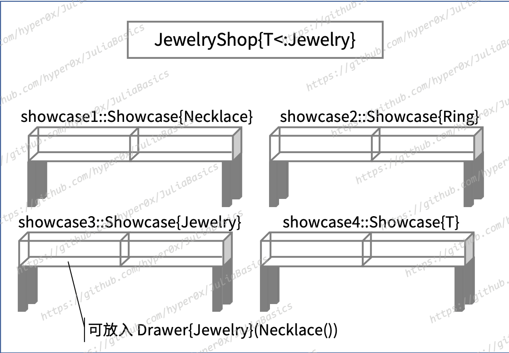
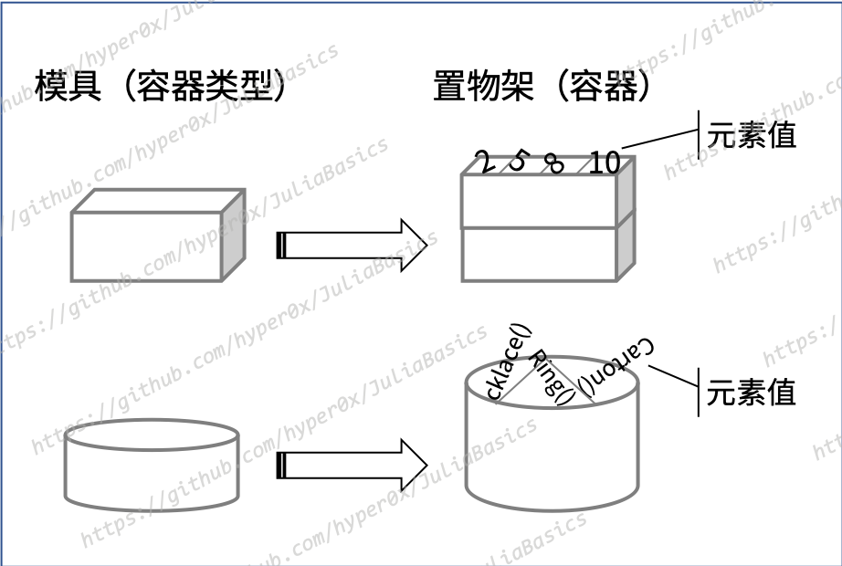

{{TOC}}

# 第 7 章 参数化类型

在第 4 章，我们介绍了 Julia 的类型系统，探讨了类型与类型以及类型与值之间的关系，还讲解了两个特殊的类型和三种主要的类型。接下来，我们会讲述更多的类型和相关知识。你将学习到那些定义更加复杂、功能更加强大的类型，以及操纵这些类型及其值的方法。

## 7.1 类型的参数化

参数化（parametric）是 Julia 类型系统中的一个非常重要且强大的特性。它允许类型自身包含参数，并使得一个这样的类型就可以代表整个类型族群。像`Ref{T}`这样的参数化类型，可以代表的类型的数量是无限的，因为我们可以用任何一个类型的名称替换掉`T`，从而表示一种确定的（或者说具体的）类型，如`Ref{String}`。进一步讲，随着类型中参数值的不同，这个类型的字面量就可以表示该类型族群中的某一个特定的类型。顺便说一下，我有时只会写出参数化类型的名称，而省略掉后面的花括号。这主要是为了简化描述和节约篇幅。到了后面我们会看到，这种表示方式依然是合法的。

Julia 已经预定义了不少的参数化类型。我们在前面已经见过几个，包括`Ref`、`Union`、`Complex`和`SubString`等。对它们的进一步说明如下：

- `Ref{T}`：它是专门用来做引用的类型。要想让它成为某一个类型的引用类型，我们就需要在其花括号中填入那个类型的名称。例如，`Ref{UInt32}`就表示针对`UInt32`类型的引用类型。
- `Union{Types...}`：这个类型的花括号中可以有多个类型名称。这使它可以表示为针对那些类型的联合类型，从而让那些类型的值都成为这个联合类型的实例。例如，`Union{Integer, AbstractString}`就联合了`Integer`类型和`AbstractString`类型，从而使整数值和字符串值都变成了它的实例。
- `Complex{T<:Real}`：代表复数的的类型。因为复数的实部和虚部都必须是实数，所以`Complex`类型的参数一定要是`Real`类型的子类型。
- `SubString{T<:AbstractString}`：代表子字符串的类型。由于子字符串值只能基于字符串值创建，因此`SubString`类型的参数必须继承自`AbstractString`。

可以看到，前两个参数化类型对其参数都没有做显式的约束。也就是说，它们的参数值可以是任意的类型。当然，我们是可以对类型的参数做出约束的。

我们之前已经讲过操作符`<:`。在类型定义中，它用于表示当前类型直接继承自哪一个抽象类型。它也可以与两个类型字面量构成一个表达式，以判断这两个类型之间是否存在直接或间接的继承关系。而在类型的参数定义中，`<:`则用来表明参数值的有效范围，或者说参数值必须是哪一个类型的（直接或间接的）子类型。由于一个类型也是它自己的子类型，所以这里的有效范围也会包含处于`<:`右侧的那个类型。

后两个参数化类型都在它们的花括号中对其参数进行了约束。更确切地说，它们都对其类型参数（type parameter）的上限进行了定义。

我们在这里回顾这几个参数化类型，是为了帮助你重温对这种类型的宏观认识。这算是一个热身。接下来，我们将要说明怎样定义参数化类型。

### 7.1.1 基本特征

我们之前说过，参数化类型就相当于一种对数据结构的泛化定义。因此，它也常被称为泛化类型，简称泛型。此种类型的奥秘就藏在紧随类型名称之后的那对花括号当中。

对于一个参数化类型，比如`Ref{T}`，我们称其花括号中的英文字母`T`（Type 的缩写）为类型参数。然而，这个字母只是一个占位符而已，用于表示这个位置上需要一个具体的参数值（别忘了，类型也是一种值）。原则上，这个占位符的名称可以是任何一个或多个可打印的 Unicode 字符。不过，按照惯例，英文字母`T`仍然是这里的首选。

Julia 并没有对一个类型可以拥有多少个参数做出限制。不过，类型一旦定义完成，其类型参数的个数就会固定下来，并且不可再被更改。而`Union{Types...}`类型着实是一个特例，因为 Julia 并没有限制我们使用它联合多少个类型。它甚至还可以不联合任何类型，即`Union{}`。同样特殊的还有代表元组类型的`Tuple{Types...}`。有些可惜，作为 Julia 程序开发者的我们是无法编写这样的参数化类型的。

那么我们可以编写什么样的参数化类型呢？请接着往下看。

### 7.1.2 参数化复合类型

参数化的复合类型应该是我们最常定义的一种参数化类型。如果我们想为抽屉这样的物件建立程序模型，那么可以这样来做：

```julia
julia> mutable struct Drawer{T}
           content::T
       end 
```

理想状况下，一个足够大的抽屉可以容纳任何物品。所以我并没有对类型参数`T`进行约束。此外，我只为这个复合类型编写了一个字段`content`，其类型同样是`T`。

通常，一个复合类型的类型参数总是要被用在这个类型的内部的，否则也就没有必要为它定义类型参数了。对于`Drawer`类型，什么种类的物品可以被放进抽屉，恰恰取决于其类型参数的值是什么。比如，`Drawer{String}`类型的类型参数已经确定，那么它的字段`content`的类型肯定也是`String`。所以，我们只能把`String`类型的“物品”放到这类抽屉里：

```julia
julia> drawer1 = Drawer{String}("a kind of goods")
Drawer{String}("a kind of goods")

julia> drawer1.content = 'G'
ERROR: MethodError: Cannot `convert` an object of type Char to an object of type String
# 省略了一些回显的内容。

julia> 
```

这里有一个特别之处，像`Drawer{T}`这样的表示方式只能被用在它的定义当中。如果我们想在其他地方指代这个参数化类型，那么只写出它的名称`Drawer`就好了。或者说，在其定义之外的任何地方，`Drawer{T}`都只能用于表示该参数化类型的某个确定类型（如`Drawer{String}`）。所以，这时的`T`必须被替换为一个已声明的类型名称。对比如下：

```julia
julia> Drawer{T} 
ERROR: UndefVarError: T not defined
# 省略了一些回显的内容。

julia> Drawer
Drawer

julia> 
```

另外，由于参数化类型可以代表整个类型族群，而它的每一个确定类型都是这个类型族群中的一员。因此，参数化类型本身是它的所有确定类型的超类型。例如：

```julia
julia> Drawer{String} <: Drawer
true

julia> Drawer{Char} <: Drawer
true

julia> Drawer{Int} <: Drawer
true

julia> 
```

注意，这是除了使用操作符`<:`以外的另一种可以形成继承关系的声明方式。

让我们再回到抽屉的话题上来。我们都知道，很多家具都有抽屉。无论是家用的还是商用的都是如此。如果这里指的是商用展柜中的抽屉，那我们还可以接着构建模型：

```julia
julia> mutable struct Showcase{T}
           drawer1::Drawer{T}
           drawer2::Drawer{T}
       end

julia> 
```

上面这个展柜有两个抽屉。显然，如果这是一个首饰的展柜，那么它的抽屉里就只能放置首饰。但如果这是一个玩具展柜，那这两个抽屉里就只会放置一些玩具。所以，在确定的参数化类型`Showcase{String}`中，`drawer1`和`drawer2`的类型都只会是`Drawer{String}`。示例如下：

```julia
julia> showcase1 = Showcase{String}(Drawer("goods1"), Drawer("goods2"))
Showcase{String}(Drawer{String}("goods1"), Drawer{String}("goods2"))

julia> 
```

可以看到，我在实例化`Showcase{String}`类型的时候并没有在类型名称`Drawer`之后编写花括号。但是，Julia 依然知道我们是在构建`Drawer{String}`类型的值。这要感谢 Julia 的类型推断。实际上，在这种情况下，我们连`Showcase`后面的花括号都可以省略掉：

```julia 
julia> showcase1 = Showcase(Drawer("goods1"), Drawer("goods2"))
Showcase{String}(Drawer{String}("goods1"), Drawer{String}("goods2"))

julia> 
```

Julia 可以根据我们给予的`"goods1"`和`"goods2"`推断出这里的`Drawer`和`Showcase`的类型参数为`String`。

现在，假设这就是一个首饰的展柜，那么我们需要先对首饰进行一些定义：

```julia
julia> abstract type Jewelry end

julia> struct Necklace <: Jewelry end

julia> struct Ring <: Jewelry end

julia> 
```

我定义了代表首饰的抽象类型`Jewelry`，还定义了该类型的子类型`Necklace`（项链）和`Ring`（戒指）。为了尽量简单，我们不去关心这些首饰的具体特征以及它们的定价。所以，我没有为`Necklace`和`Ring`添加任何字段。

有了前面这些定义，我们就可以开始为首饰店建模了：

```julia
julia> mutable struct JewelryShop{T<:Jewelry}
           showcase1::Showcase{Necklace}
           showcase2::Showcase{Ring}
           showcase3::Showcase{Jewelry}
           showcase4::Showcase{T}
       end

julia> 
```

在这个店铺中，第 1 个展柜专用于放置项链，第 2 个展柜专用于放置戒指。而第 3 个展柜和第 4 个展柜都是机动的展柜。我们可以根据实际需要确定它们的用途。


_图 7-1 首饰店类型的示意_

不过要注意，虽然我为`JewelryShop`的类型参数做了约束，使该参数的值必须是`Jewelry`的子类型，但`showcase3`和`showcase4`这两个字段的类型仍然是不同的。对于`showcase3`，无论`JewelryShop`的具体参数值是什么，它都代表可以放置任何首饰的展柜。而`showcase4`就不同了，它可以放置哪种首饰完全取决于`JewelryShop`的具体参数值。

另外还要注意，虽然复合类型`Necklace`和`Ring`都是抽象类型`Jewelry`的子类型，但是基于它们的参数化类型之间却不存在这样的继承关系。比如，`Drawer{Necklace}`和`Drawer{Ring}`都肯定不是`Drawer{Jewelry}`的子类型。同理，`Showcase{Necklace}`和`Showcase{Ring}`也都不是`Showcase{Jewelry}`的子类型。代码演示如下：

```julia
julia> Drawer{Necklace} <: Drawer{Jewelry}, Drawer{Ring} <: Drawer{Jewelry}
(false, false)

julia> Showcase{Necklace} <: Showcase{Jewelry}, Showcase{Ring} <: Showcase{Jewelry}
(false, false)

julia> 
```

这种特性被称为非转化（invariant）。也就是说，对于这些确定的参数化类型，不会由于其参数值之间存在继承关系，就形成继承关系。与之相对的特性有协变（covariance）和逆变（contravariance）。

我们在实例化`Showcase{Jewelry}`的时候就可以明显地感知到这一特性。像下面这样构建它的值是不行的：

```julia
julia> Showcase{Jewelry}(Drawer(Necklace()), Drawer(Ring()))
ERROR: MethodError: Cannot `convert` an object of type Drawer{Necklace} to an object of type Drawer{Jewelry}
# 省略了一些回显的内容。

julia> 
```

依据提示可知，报错的原因是`Drawer{Necklace}`类型的值无法被转换成`Drawer{Jewelry}`类型的值。对于像`Showcase{Jewelry}`这样的确定的参数化类型，Julia 会为它自动生成一个全名（即携带花括号的名称）相同的构造函数。这个构造函数接受的参数与该类型的字段一一对应，但参数的类型并没有被约束。

也就是说，我们在使用这样的构造函数时，必须提供数量与该类型的字段数相同的参数值，但参数值的类型可以是任意的。Julia 一旦发现参数值的类型与对应字段的类型不符，就会试图通过调用`convert`函数进行参数类型转换。如果转换不成功，那么就会直接报错。

现在我们知道了，`Showcase{Jewelry}`类型的两个字段都是`Drawer{Jewelry}`类型的。但是，我们传给它的构造函数的参数值`Drawer(Necklace())`和`Drawer(Ring())`却分别是`Drawer{Necklace}`类型和`Drawer{Ring}`类型的。在这种情况下，Julia 会试图进行参数类型转换。可是，转换失败了，因为`Drawer{Necklace}`和`Drawer{Ring}`都不是`Drawer{Jewelry}`的子类型。错误由此产生。

不过，我们只要稍加改动就可以使这段代码合法化：

```julia
julia> Showcase{Jewelry}(Drawer{Jewelry}(Necklace()), Drawer{Jewelry}(Ring()))
Showcase{Jewelry}(Drawer{Jewelry}(Necklace()), Drawer{Jewelry}(Ring()))

julia> 
```

注意，我们这次传给`Showcase{Jewelry}`函数的是两个`Drawer{Jewelry}`类型的值。因为`Jewelry`是一个抽象类型，所以它本身不能被实例化。但由于`Necklace`和`Ring`都是它的子类型，因此把这两个类型（之一）的值传给`Drawer{Jewelry}`的构造函数是完全没有问题的。这与上述参数化类型之间的关系形成了鲜明的对比。

参数化类型的非转化特性不仅会体现在它们的构造函数上，也会同样体现在普通的函数上。比如，我们要定义用来描述上述类型值的函数`describe`，那么对于以普通的复合类型`Jewelry`为首的类型族群来说，定义一个函数就足够了：

```julia
describe(jewelry::Jewelry) = "A $(typeof(jewelry))"
```

但对于以参数化的复合类型`Drawer`为首的类型族群而言，我们如果只定义下面这个函数：

```julia
describe(drawer::Drawer{Jewelry}) = "$(describe(drawer.content))"
```

那么就无法让类型为`Drawer{Necklace}`或`Drawer{Ring}`的参数值传进去。不过，这里有两种解决办法。第一种办法，指定参数化类型但不指定其类型参数：

```julia
describe(drawer::Drawer) = "$(describe(drawer.content))"
```

这就是在告诉 Julia，参数值只要是`Drawer`类型的，不论它的类型参数值是什么，全都符合这个函数的定义。这样做固然是可以的。但在很多时候，适用范围太广通常不是一件好事。

第二种办法是，指定参数化类型及其类型参数，但只约束后者的有效范围。例如：

```julia
describe(drawer::Drawer{<:Jewelry}) = "$(describe(drawer.content))"
```

我们把参数`drawer`的类型声明为了`Drawer{<:Jewelry}`。注意，在`<:`的左侧并没有`T`。在这种情况下，只要参数值的类型是`Drawer`，且它的类型参数值是`Jewelry`的子类型，就符合这个`describe`函数的定义。如此一来，我们向该函数传入`Drawer{Necklace}`或`Drawer{Ring}`类型的参数值就都没有问题了。

第二种解决办法是更好的。因为为了程序的稳定性和运行效率，我们总是需要给予恰当的类型约束。

最后，顺便说一下，我们可以把`Drawer{<:Jewelry}`看做是对协变类型的模拟。而`<:`在这里可以被视为转化标注（variance annotation）。所谓的协变是指，同一个参数化类型的多个确定类型之间可以存在继承关系，并且这种继承关系完全取决于它们的类型参数值之间的继承关系。例如：

```julia
julia> Drawer{<:Necklace} <: Drawer{<:Jewelry}, Drawer{<:Ring} <: Drawer{<:Jewelry}
(true, true)

julia> Drawer{Necklace} <: Drawer{<:Jewelry}, Drawer{Ring} <: Drawer{<:Jewelry}
(true, true)

julia> 
```

不过，再次强调一下，参数化类型本身具有的是非转化特性。我们虽然可以通过上述方式对协变类型进行模拟，但对此要持有谨慎的态度，并要关注运用的合理性。因为这在为我们提供便利的同时，还可能会让程序变得更加复杂。

### 7.1.2 参数化抽象类型

参数化的抽象类型与参数化的复合类型有着很多的共同点。比如，参数化的抽象类型定义相当于声明了一个抽象类型的族群。又比如，参数化的抽象类型本身是它的所有确定类型的超类型。还比如，对于确定的参数化抽象类型，不会由于其参数值之间存在继承关系，就形成继承关系（即非转化特性）。

那么，参数化的抽象类型有什么特殊的功用吗？显然，与普通的抽象类型一样，参数化抽象类型可以帮助我们搭建自己的类型层次结构。并且，它还可以构建出更加丰富的类型体系。

如果我们有如下的类型定义：

```julia
# 代表储物空间的抽象类型。
abstract type StorageSpace{T} end

# 代表抽屉的类型。
mutable struct Drawer{T} <: StorageSpace{T}
    content::T
end

# 代表展柜的类型。
mutable struct Showcase{T<:Goods} <: StorageSpace{T}
    drawer1::Drawer{T}
    drawer2::Drawer{T}
end
```

那么，对于每一个`StorageSpace`类型的确定类型，都会有一个`Drawer`类型的确定类型和一个`Showcase`类型的确定类型与之相对应。并且，后两者总是前者的子类型。例如：

```julia
julia> Drawer{Jewelry} <: StorageSpace{Jewelry}, Showcase{Jewelry} <: StorageSpace{Jewelry}
(true, true)

julia> Drawer{Necklace} <: StorageSpace{Necklace}, Showcase{Necklace} <: StorageSpace{Necklace}
(true, true)

julia> Drawer{Ring} <: StorageSpace{Ring}, Showcase{Ring} <: StorageSpace{Ring}
(true, true)

julia> 
```

我们可以看到，这个类型体系是立体的，而不是平面的。更重要的是，如果我们定义更多的`StorageSpace`类型的子类型，那么这个体系的规模就将呈现指数级的增长。

与参数化的复合类型一样，我们也可以对参数化抽象类型的类型参数做出范围约束。不过，对于以超类型的身份出现在其他类型定义当中的参数化抽象类型，我们就不能这么做了。这是什么意思呢？举个例子，我们在前面是这样再次定义`Showcase`类型的：

```julia
mutable struct Showcase{T<:Goods} <: StorageSpace{T}
    drawer1::Drawer{T}
    drawer2::Drawer{T}
end
```

在这个定义当中，以超类型的身份出现的参数化抽象类型`StorageSpace`不能被写成`StorageSpace{T<:Goods}`或者`StorageSpace{<:Goods}`。因为这不符合 Julia 的语法，会使它报错。即使这个参数化抽象类型本身声明的类型参数就是`{T<:Goods}`也是如此。这是合乎情理的，因为参数化类型一旦定义完成，我们就不能再去修改其类型参数的声明了。在这里，我们可以把它写成`StorageSpace{T}`，也可以写成像`StorageSpace{Goods}`这样的确定类型。

你可能已经注意到了，我对`Showcase`类型的类型参数做了范围约束，其值必须是`Goods`的子类型。我在前面没有给出`Goods`类型的定义。它其实就是一个代表了商品的普通的抽象类型而已。

没错，我们可以在参数化类型的定义当中对其超类型的类型参数做出进一步的约束。不过，对于进一步约束的方向，Julia 并没有严格的规定。我们既可以收紧先前的约束，也可以放宽先前的约束。我又定义了如下类型：

```julia
# 代表玩具的类型。
abstract type Toy <: Goods end

# 代表毛绒玩具的类型。
struct StuffedToy <: Toy end

# 代表电动玩具的类型。
struct ElectricToy <: Toy end

# 代表玩具箱的抽象类型。
abstract type ToyBox{T<:Toy} <: StorageSpace{T} end

# 代表纸板箱的类型。
mutable struct Carton{T<:Goods} <: ToyBox{T}
    content::T
end
```

抽象类型`ToyBox`是`StorageSpace`类型的又一个子类型，并且它对后者的类型参数`T`做了进一步的范围约束，使它的值必须是`Toy`的子类型。类似的，复合类型`Carton`是`ToyBox`类型的子类型，同时它也对后者的类型参数做出了自己的约束。但是，`Carton`对`T`的约束比`ToyBox`对`T`的约束更加宽松，因为`Goods`是`Toy`的超类型。这在 Julia 中是允许的。

即便如此，我依然建议你在做进一步约束时要收紧而不要放宽。这起码有 3 个好处：

1. 这样做是对超类型的延续，而不是破坏。从类型层次设计的角度讲，子类型的适用范围总是应该比超类型的适用范围更小。或者说，超类型的应用场景起码应该涵盖子类型的应用场景。
2. 这样做更容易使人理解。顺应当前的类型继承纹理，可以让代码的阅读者更快速地领会到类型定义者的意图。虽然“在纸板箱里放置商品”从逻辑上讲是没有问题的，但这会让人对“`Carton`继承`ToyBox`”产生疑惑。难道这样的纸板箱只是玩具箱的一种吗？这显然有些自相矛盾了。
3. 这样做可以避免类型的使用者犯错。使用者一旦看到了当前类型的定义，就可以完全了解到关于其类型参数的约束。因为当前类型对其参数的约束是最严格的。否则，如果像前面那样，那么`Carton{Goods}(StuffedToy())`就一定会使 Julia 报错。因为它不符合`ToyBox`对`T`的约束。

总之，虽然参数化的抽象类型可以构建出更加丰富的类型体系，但它对类型体系的设计者也提出了更高的要求。这关乎类型体系的质量和使用者的心智负担，值得我们仔细思考。

### 7.1.3 参数化原语类型

我们也可以定义参数化的原语类型。不过，与前面两种参数化类型相比，参数化原语类型的意义就不太大了。

我们都知道，原语类型的结构仅仅是一个扁平的比特序列。在定义这种类型的时候，我们只需要指定其比特序列的长度，也就是其值需要占据的存储空间的大小。因此，即使我们在这种类型的名称后面添加了类型参数，也无法在它的定义体中引用这个参数。比如，Julia 预定义的原语类型`Ptr`是这样的：

```julia
# 32-bit system:
primitive type Ptr{T} 32 end

# 64-bit system:
primitive type Ptr{T} 64 end
```

在这种情况下，类型参数已经失去了泛化数据结构的作用，而仅能作为特定类型的一种标签。例如，`Ptr{Char}`代表了可以指向字符值的那种指针的类型，而`Ptr{Int64}`则代表可以指向`Int64`类型值的那种指针的类型。

由于上述的特定类型都是`Ptr`类型的子类型，所以我们说原语类型依然可以因参数化而成为当下的类型族群之首。另外，参数化的原语类型依然具有非转化特性。

## 7.2 参数化的更多知识

我们现在已经知晓了定义参数化类型的基本知识。但这还不够，我们还需要了解更多，以便做到游刃有余。

### 7.2.4 类型参数的值域

到目前为止，我们一直在说，参数化类型的参数值可以是任何一个类型。或者说，我们可以用任意一个类型的名称替换掉类型参数的占位符（比如`T`），从而表示一种确定的参数化类型。

但实际上，类型参数的值域中还包含了所有位类型的值。所谓的位类型，指的就是那些传统的数据类型。这种类型的值不可变，并且其中不包含任何对其他值的引用。位类型的值总是可以由若干个连续的比特（位）承载。并且，存储同一个位类型的任何值所用的比特个数总是相同的。你可能已经猜到了，所有的原语类型都属于位类型。

我们对此不用死记硬背。如果你不确定一个类型是否属于位类型的话，那么可以使用`isbitstype`函数来判断。例如：

```julia
julia> isbitstype(Bool), isbitstype(Float64)
(true, true)

julia> isbitstype(Complex), isbitstype(Complex{Int64})
(false, true)

julia> isbitstype(Char), isbitstype(String)
(true, false)

julia> isbitstype(Union), isbitstype(Union{String})
(false, false)

julia> isbitstype(Ptr), isbitstype(Ptr{Char})
(false, true)

julia> 
```

此外，Julia 还有提供了`isbits`函数。该函数用于判断一个值是否是位类型的实例。

如果要解释位类型的值是怎样应用在类型参数中的话，我觉得最好的案例莫过于我们在前面见过很多次的类型`Array`。`Array`是一个参数化类型，它的全名是`Array{T,N}`。其中的类型参数`T`用于确定数组的元素类型，而类型参数`N`则用于确定数组的维数（即维度的数量）。也就是说，数组的维数与它的元素类型一样都会被写入到它的类型字面量中。原则上，`N`的取值可以是任何`Int64`类型的值（如果在 32 位的计算机系统中，那么就是任何`Int32`类型的值）。但在实际应用中，`N`的值肯定不能是负数。

我们在自定义参数化类型的时候，如果允许类型参数的取值包含位类型的值，那么就需要仔细地考量。比如，允许哪个或哪些位类型的值、这些值是否都能够被正确地接受和处理，等等。若有必要，你可以根据实际情况使用`isbitstype`函数、`isbits`函数以及其他的方式帮助抉择。

### 7.2.5 类型的类型

我们在前面说过，Julia 中的类型的类型是`DataType`。包括之前讲过的特殊类型`Any`和`Union`在内，所有的类型都是`DataType`类型的实例。就连`DataType`类型本身的类型也是`DataType`。

不过，对于参数化类型来说，情况就不太一样了。类型参数已确定的参数化类型（如`Drawer{Jewelry}`）依然是`DataType`类型的实例。但是，未确定的参数化类型（如`Drawer`)的类型就不是`DataType`了，而是`UnionAll`。演示代码如下：

```julia
julia> typeof(Drawer{Jewelry}), typeof(Drawer{Ring})
(DataType, DataType)

julia> typeof(Drawer), typeof(Drawer{})
(UnionAll, UnionAll)

julia> 
```

注意，`Drawer{}`等同于`Drawer`，因为前者同样没有明确类型参数的值。它们代表的都是还未完全确定的参数化类型。

另外，我们需要谨记“某个类型的类型”与“某个类型的超类型”这两个概念之间的不同。虽然它们要解答的都是类型的归类问题，但不同的是：“某个类型的类型”说的是这个类型的先天归属，就像在说一个人的血统；而“某个类型的超类型”说的是一个类型的后天分类，就像在说一个人的国籍。一个值（别忘了类型也是一种值）从诞生之日起就自然会有一个类型，而一个类型继承自哪一个超类型就需要我们通过编写代码来显式地指定了。显然，这是两个不同维度的归类问题。我们可以说这两者是正交的。一个类型既会有它隶属的类型，也会有它从属的超类型（最起码有`Any`），并且各自独立、互不干扰。

上面这两个概念很容易被混淆，尤其对于初学现代编程语言的人来说。既然讲清楚了它们的区别，那么我们再回到“类型的类型”这个问题上来。

我们已经了解了`DataType`类型，但对`UnionAll`这个类型还很陌生。这个类型用于描述所有未确定的参数化类型。也就是说，在这个类型下的每一个参数化类型中，至少还有一个类型参数没有明确的取值。单从字面上看，我们也可以感受到，它可以代表一个参数化类型能够包含的所有确定类型的联合。

由于像`Drawer`这样的参数化类型中还有一些东西没有被确定下来，所以它们不能算是正常的数据类型（从其类型不是`DataType`就可以印证这一点）。因此，它们也无法被实例化。

### 7.2.6 值化的表示法

既然说到了`UnionAll`类型，那么我们就不得不提及针对此类型的实例（也就是参数化类型）的表示法，也可以称之为参数化类型的值化表示法。这种表示法与参数化类型定义中的表现手法很相似，但前者还需要用到`where`关键字。如果用这种表示法来表示`Drawer`类型的话，那么就是：

```julia
julia> Drawer{T} where T
Drawer

julia> 
```

`Drawer{T} where T`代表了`Drawer`类型所能包含的所有确定类型的联合。而且，这个类型还对它的类型参数做出了范围约束，如跟在`where`后面的内容所示。只不过，这里在`where`后面的只有`T`，所以相当于没有约束。如果我们想为这里的`T`添加约束，那么可以像下面这样写：

```julia
julia> Drawer{T} where T<:Jewelry
Drawer{T} where T<:Jewelry

julia> 
```

显然，值化表示法让我们可以在参数化类型的定义之外为其类型参数制定范围约束。我们之前运用过的`Drawer{<:Jewelry}`其实就是`Drawer{T} where T<:Jewelry`的一种简写形式。但对于拥有多个类型参数的参数化类型来说，这种简写形式就显得不够灵活了。比如，对于`Array{T,N}`类型，如果我们使用简写形式的话，就只能同时约束或确定它的所有类型参数。代码如下：

```julia
julia> Array{<:Jewelry, 1}
Array{#s11,1} where #s11<:Jewelry

julia> Array{<:Jewelry, <:UInt32}
Array{#s9,#s10} where #s10<:UInt32 where #s9<:Jewelry

julia> 
```

从 REPL 环境回显的内容可知，第一行代码就相当于`Array{T,1} where T<:Jewelry`，而第二行代码则相当于`Array{T,N} where N<:UInt32 where T<:Jewelry`。

没错，我们可以在参数化类型的全名后面追加多个`where`，但是每一个`where`都只能针对单个类型参数做出约束。跟在`where`后边的那些类型参数也常被称为类型变量（type variable），因为它们就像变量那样可以在某个类型的定义之上进行取值。只不过，类型变量取的不是确切的值，而是值域。所以我们也可以说，`where`是专门用来划定类型参数的值域的。请注意，如果基于某个类型定义的多个`where`划定了同一个类型参数的值域，那么 Julia 只会认可最左边的那一个。

如果我们想用前述的简写形式只对一部分类型参数划定值域，那么就会收到如下的报错：

```julia
julia> Array{<:Jewelry, N}
ERROR: UndefVarError: N not defined
# 省略了一些回显的内容。

julia> Array{T, <:UInt32}
ERROR: UndefVarError: T not defined
# 省略了一些回显的内容。

julia>  
```

不过这解决起来相当容易，不简写就可以了：

```julia
julia> Array{T,N} where T<:Jewelry where N
Array{T,N} where T<:Jewelry where N

julia> Array{T,N} where N<:UInt32 where T
Array{T,N} where N<:UInt32 where T

julia> 
```

还记得吗？如果在`where`后面的只有类型参数的占位符，那么就相当于对该类型参数没做任何约束。

另外还有一种等价的解法，那就是为它创建一个带有类型参数的别名（alias），如：

```julia
julia> JewelryArray{N} = Array{<:Jewelry, N}
Array{#s19,N} where #s19<:Jewelry where N

julia> Vector{T} = Array{T, 1}
Array{T,1} where T

julia> 
```

总之，值化表示法使我们可以对参数化类型所能代表的确定类型的范围进行相当灵活的再定制。并且，这种再定制丝毫不会影响到参数化类型的原有定义。此外，由于这种表示法把参数化类型表达成了一种值，所以它能让参数化类型赋给某个变量或常量、在函数之间传来传去、成为其他参数化类型的参数值，等等。不过别忘了，如此表示的参数化类型仍然是一种类型，所以它依旧能够作为变量、复合类型的字段、函数的参数等等的类型。

## 7.3 容器：元组

容器在 Julia 中也被称为集合。但由于集合一词与有着广泛应用的数据结构 Set 的中文译名重复，因而容易导致歧义和误解，所以我们在本书中会统一称之为容器，而集合这个词将特指像 Set 那样的容器。

容器的类型通常都是参数化类型。在很多编程语言中，这也是泛型最经典的运用场景。Julia 中的容器类型就像一种模具，用来制造含有若干格子的置物架。模具不同，制造出来的置物架也不同，并且每一个模具都只能制造一类置物架。每一类置物架都有自己独特的内部结构和存取物品的方式（或者说操作规则），而且同一类置物架在这些方面一定是相同的。


_图 7-2 容器类型的示意_

通过实例化容器类型构造出来的值就是容器，而存放在容器中的值则被统称为元素值。有的容器类型允许同一个容器接纳不同类型的元素值，但有的容器类型却只让一个容器接受相同类型的元素值。有的容器可以容纳的元素的数量是固定的，而有的容器却可以自行扩展甚至收缩。

我们下面就来一起讨论 Julia 中最简单且常用的容器——元组。

### 7.3.1 元组概述 

元组（tuple）是一种很简单的容器。它可以包含若干个任意类型的元素值。我们在前面其实已经见过这类值很多次了。看一个例子你就应该能明白了：

```julia
julia> Drawer{Necklace} <: Drawer{Jewelry}, Drawer{Ring} <: Drawer{Jewelry}
(false, false)

julia> typeof(ans)
Tuple{Bool,Bool}

julia> 
```

我在这里输入的第一行代码是我们之前展示过的一个例子。这行代码包含了两个表达式，并以英文逗号分隔。REPL 环境回显给我们的求值结果是`(false, false)`。这个结果值实际上就是一个元组。第二行代码的求值结果`Tuple{Bool,Bool}`就是它的类型。

当我们像上面这样让 REPL 环境同时对多个表达式求值时，该环境就会把求值结果都塞入到一个元组值中并回显给我们。这种元组值总是由圆括号包裹，并以英文逗号分隔其中的多个元素值。

此外，我们还可以看到，元组类型`Tuple{Bool,Bool}`中有两个参数值。它们依次反映了其实例中的每一个元素值的类型。不过由于`(false, false)`中的两个元素值类型相同，所以在视觉上没有显现出来。但我们要记住，元组类型不但会确定其所有元素的类型，还会体现元素的顺序。

### 7.3.2 普通的元组

普通元组的表示形式与我们调用函数时传入参数值的方式很相似。下面来看一个之前展示过的示例：

```julia 
julia> function sum1(a::Real, b::Real)
           a + b
       end
sum1 (generic function with 1 method)

julia> sum1(1.2, 5)
6.2

julia> 
```

函数`sum1`拥有一个参数列表。这个参数列表由圆括号包裹，其中定义了两个参数。在调用`sum1`函数的时候，我们需要传给它两个符合定义的参数值。在它下面的调用表达式中，我给出的参数值是用`(1.2, 5)`来呈现的。这其实就是一种元组。

元组类型与一般的参数化类型有着一个很明显的不同——它具有协变的特性。我们在前面解释过什么是协变。举个例子，有两个确定的元组类型`Tuple{Real}`和`Tuple{Integer}`。由于它们的类型参数值`Real`‌和`Integer`之间存在继承关系，所以`Tuple{Real}`和`Tuple{Integer}`之间也有着相同的继承关系。验证的代码如下：

```julia
julia> Tuple{Real} >: Tuple{Integer}
true

julia> Tuple{Real, Char} >: Tuple{Integer, Char}
true

julia> Tuple{Real, AbstractChar} >: Tuple{Integer, Char}
true

julia> Tuple{Real, Char} >: Tuple{Integer, AbstractChar}
false

julia> Tuple{Real, AbstractChar} >: Tuple{Integer, String}
false

julia> Tuple{Real, Char} >: Tuple{Integer}
false

julia> Tuple{Real} >: Tuple{Integer, Char}
false

julia> 
```

可以看到，仅当两个元组类型拥有相同数量的参数值，并且所有对应位置上的参数值都存在方向一致的继承关系，这种继承关系才会在这两个元组类型上延续。

在值的操作方面，元组值与字符串值有着很多相同之处。比如，我们可以使用索引号访问到一个元组值中的某个元素值。我们现在有这样一个元组值：

```julia
julia> tuple1 = (125, 3.1, '中', "编程")
(125, 3.1, '中', "编程")

julia> typeof(tuple1)
Tuple{Int64,Float64,Char,String}

julia> 
```

那么，索引表达式`tuple1[1]`的求值结果就是`Int64`类型的`125`，而表达式`tuple1[2]`的求值结果则是`Float64`类型的`3.1`，以此类推。注意，这里的索引号依然是从`1`开始的。与字符串值类似，我们不能通过索引表达式替换元组中的任何元素值。因为 Julia 中的元组也都是不可变的！

我们还可以用范围索引表达式截取元组中的某一段：

```julia
julia> tuple1[1:3]
(125, 3.1, '中')

julia> typeof(ans)
Tuple{Int64,Float64,Char}

julia> 
```

这种表达式的求值结果也会是一个元组，而且那些被截取到的元素值的类型也都不会改变。

我们之前讲过的那 4 个用于搜索的函数，即：`findfirst`、`findlast`、`findprev`和`findnext`，都可以被用来搜索元组中的元素值。只不过，对于元组，我们传给它们的第一个参数值必须是一个用来做条件判断的函数。也就是说，这个函数的结果值必须是`Bool`类型的。下面是一些示例：

```julia
julia> findfirst(isequal('中'), tuple1)
3

julia> findlast(isequal('中'), tuple1)
3

julia> findprev(isequal('中'), tuple1, 4)
3

julia> findnext(isequal('中'), tuple1, 2)
3

julia> findnext(isequal('中'), tuple1, 4) == nothing
true

julia>  
```

另外，比较操作符也可以直接用于元组之间的比较。在这种情况下，Julia 会依次比较两个元组中的每一个元素值，直到足以做出判断为止。

对于元组的拼接，操作符`+`和`*`都是无能为力的。这时我们可以使用`tuple`函数和符号`...`。它们的用法如下：

```julia
julia> tuple(tuple1..., tuple1...)
(125, 3.1, '中', "编程", 125, 3.1, '中', "编程")

julia> 
```

我们在前面说过，符号`...`的作用就是，把紧挨在它左边的那个值中的所有元素值都平铺开来，并让它们都成为独立的参数值。所以，上面的这个表达式与如下的表达式等价：

```julia
julia> tuple(tuple1[1], tuple1[2], tuple1[3], tuple1[4], tuple1[1], tuple1[2], tuple1[3], tuple1[4])
(125, 3.1, '中', "编程", 125, 3.1, '中', "编程")

julia> 
```

除此之外，我们还可以仅用圆括号来拼接元组：

```julia
julia> (tuple1..., tuple1...)
(125, 3.1, '中', "编程", 125, 3.1, '中', "编程")

julia> 
```

元组的拼接总会产生新的元组。但这样的元组不一定是全新的，因为其中的元素值不一定都是位类型的值。还记得吗？位类型的值不会包含任何对其他值的引用。更进一步地说，如果原有元组中的元素值引用了其他值，那么在由拼接产生的新元组中，对应的元素值仍然会引用同一个值。例如，我们有如下的两个元组：

```julia
julia> tuple2 = ([1,2,3], [4,5,6,7])
([1, 2, 3], [4, 5, 6, 7])

julia> tuple2_2 = (tuple2..., tuple2...)
([1, 2, 3], [4, 5, 6, 7], [1, 2, 3], [4, 5, 6, 7])

julia> 
```

元组`tuple2`包含了两个元素值。这两个元素值都是数组（由方括号包裹，并以英文逗号分隔其包含的多个元素值）。而元组`tuple2_2`则是两个`tuple2`的拼接。

对于一个确定的元组类型来说，只要它的参数值都属于位类型，那么这个元组类型就一定属于位类型，如：

```julia
julia> isbitstype(Tuple{Int64,Float64,Char})
true

julia> isbitstype(Tuple{Float64,String})
false

julia> isbitstype(Tuple{Real})
false

julia> 
```

但数组类型与之不同，它的任何确定类型都不属于位类型。并且，它的值都是可变的。所以，如果我们改变了元组`tuple2`包含的某个数组中的元素值，那么这种改变就会立即反映到元组`tuple2_2`中。例如：

```julia
julia> tuple2[2][1] = tuple2[2][1] * 10
40

julia> tuple2
([1, 2, 3], [40, 5, 6, 7])

julia> tuple2_2
([1, 2, 3], [40, 5, 6, 7], [1, 2, 3], [40, 5, 6, 7])

julia> 
```

我用链式的索引表达式`tuple2[2][1]`改变了`tuple2`所包含的数组`[4, 5, 6, 7]`中的第 1 个元素值。可以看到，`tuple2_2`中的两个对应的元素值都有了同样的改变。

### 7.3.3 有名的元组

有名元组中的“有名”并不是说元组有名字，而是说其中的每一个元素值都拥有自己的名字。例如：

```julia 
julia> named_tuple1 = (name="Robert", reg_year=2020, extra="something")
(name = "Robert", reg_year = 2020, extra = "something")

julia> 
```

可以看到，有名元组同样由圆括号包裹，也同样以英文逗号分隔其中的多个元素值。但与普通的元组不同的是，在有名元组中的每一个元素值的左侧，都有一个代表了元素名称的标识符和一个等号。这种表示形式与对变量的赋值极其相似。而且这两者的含义也基本相同，即：把一个值与一个标识符绑定在一起。但是，它们的作用域是不同的。虽然我们也可以通过其名称来访问有名元组中的元素值，但这些名称仅在其所属元组的上下文中可用。例如：

```julia
julia> named_tuple1[:reg_year]
2020

julia> typeof(:reg_year)
Symbol

julia> reg_year
ERROR: UndefVarError: reg_year not defined

julia> 
```

表达式`named_tuple1[:reg_year]`是普通的索引表达式的一种变体。在它的中括号里的不是一个索引号，而是一个`Symbol`类型的值。`Symbol`的值必须要以英文冒号`:`开头，并后跟一个符合变量命名规则的标识符。

`Symbol`本来是元编程中的一个概念，它的值可用于表示对变量的访问。在有名元组的上下文中，其值的含义就是指代某个元素值的名称，而在`:`后面的就是那个名称。又由于这里的`Symbol`类型值与索引号的作用是相同的，因此前述表达式的求值结果就是与`reg_year`对应的那个元素值。

有名元组的类型是`NamedTuple`。该类型也是一个参数化类型，但它只有固定个数的类型参数。元组`named_tuple1`的类型如下：

```julia
julia> typeof(named_tuple1)
NamedTuple{(:name, :reg_year, :extra),Tuple{String,Int64,String}}

julia> 
```

可以看到，这个类型的第一个参数值是一个普通的元组。在这个元组里，包含了一些`Symbol`类型的值，这些值与`named_tuple1`中的元素名称逐一对应。该类型的第二个参数值是一个确定的元组类型。它精确地体现了`named_tuple1`中的各个元素值的类型。或者说，如果`named_tuple1`中只有元素值而没有元素名，那么它的类型就会如上述示例中的第二个类型参数值。总之，一个有名元组的类型几乎确定了其实例的方方面面，除了元素的值。

还记得吗？对于确定的参数化类型，Julia 会为它自动生成一个全名（即携带花括号的名称）相同的构造函数。这就意味着，`NamedTuple`类型的构造函数名往往很长，如`NamedTuple{(:name, :reg_year, :extra),Tuple{String,Int64,String}}`。幸好，Julia 允许我们在这里走一个小捷径，不必写出那么长的构造函数名，就像这样：

```julia
julia> NamedTuple{(:name, :reg_year, :extra)}(("Robert", 2020, "something"))
(name = "Robert", reg_year = 2020, extra = "something")

julia> 
```

我在这里使用的构造函数名为`NamedTuple{(:name, :reg_year, :extra)}`。虽然也不算短，但是比前面的那个全名要好多了。这个函数名只体现了有名元组中的各个元素值的名称，而没有体现它们的类型。不过不用担心，Julia 会根据我们给予的参数值推断出元素值的类型。不知道你注意到没有，我们传给上述构造函数的参数值就是一个普通的元组。

由此可见，有名元组实际上是对普通元组的一种再封装。这从有名元组的类型字面量上也可以看出端倪。这种再封装让元组中的每一个元素值都有了自己的名字，就像我们传给函数的参数值都有对应的参数名那样。另外，顺便说一句，有名元组的类型是非转化的。

### 7.3.4 可变参数的元组

可变参数（vararg）的意思是参数的数量可多可少，并不固定。单词 vararg 有时也被写成 varargs，是一个出自计算机编程领域的合成词，由 variable 和 argument 合成而来。其含义是数量可变的参数，所以它在中文里常常被简称为可变参数。

由此延伸，可变参数的元组就是指元素数量并不固定的元组。这种元组其实就是普通的元组，只不过在其类型中会有一个特殊的类型参数值，使它的所有实例都可以接纳更多的元素值。

这种元组的类型可以是这样的：

```julia
julia> Tuple{Vararg{String}}
Tuple{Vararg{String,N} where N}

julia> 
```

其中的`Vararg{String}`就是那个特殊的类型参数值。它是`Vararg{String,N} where N`的简写形式。而`Vararg`是一个直接继承自`Any`的抽象类型，同时也是一个参数化类型。它拥有两个类型参数，其占位符分别是`T`和`N`。因此，类型`Vararg{T,N}`表达的就是`N`个`T`类型的参数。若放到元组类型的上下文中，它则表示该元组类型的所有实例都要有`N`个`T`类型的元素值。

我们可以用一个确切的整数替换掉这里的`N`，也可以放任不管。如果放任不管，那么就表示参数的数量是任意的。比如`Vararg{String}`就表示可以有任意个`String`类型的参数。所以，元组类型`Tuple{Vararg{String}}`代表的就是那些包含了任意个字符串值的元组。验证的代码如下：

```julia
julia> isa((), Tuple{Vararg{String}})
true

julia> isa(("Julia",), Tuple{Vararg{String}})
true

julia> isa(("Julia", "Python", "Golang"), Tuple{Vararg{String}})
true

julia> 
```

可以看到，不论这些元组中的字符串值有多少个，它们都是`Tuple{Vararg{String}}`类型的实例。请注意，上述示例中的`()`表示的是空元组，也就是不包含任何元素值的元组。而`("Julia",)`表示的则是只包含了一个元素值（即`"Julia"`）的元组。为了避免歧义，我们若要表示只有一个元素值的元组，就需要在该元素值的后面添加一个英文逗号。否则，Julia 就可能会把圆括号识别为包裹高优先级操作的符号，从而将其忽略掉。示例如下：

```julia
julia> ("Julia",)
("Julia",)

julia> typeof(ans)
Tuple{String}

julia> ("Julia")
"Julia"

julia> typeof(ans)
String

julia> 
```

回到可变参数的话题。如果我们把`Vararg{T,N}`中的`N`也确定下来，比如`Vararg{String,2}`，那么它表达的参数数量就是固定的了。这种类型字面量肯定不能用于表示可变参数的元组。不过它们仍然是很有用处的。请思考一下，如果我们要写出一个类型字面量，它需要代表包含了 10 个整数值的元组，那么应该怎样写呢？

实际上，我们不必写出包含 10 个类型参数值的元组类型，只需要像下面这样利用`Vararg`类型来编写就可以了：

```julia
julia> Tuple{Vararg{Int,10}}
NTuple{10,Int64}

julia> Tuple{Vararg{Int,10}} == Tuple{Int,Int,Int,Int,Int,Int,Int,Int,Int,Int}
true

julia> isa((1,2,3,4,5,6,7,8,9,0), Tuple{Vararg{Int,10}})
true

julia> 
```

示例中的`Tuple{Vararg{Int,10}}`就是答案。它等价于长长的拥有 10 个`Int`的元组类型。另外，`NTuple{10,Int64}`是`Tuple{Vararg{Int,10}}`类型的别名。更宽泛地讲，`NTuple{N,T}`总是`Tuple{Vararg{T,N}}`类型的别名。这显然可以让我们少写一些代码。

最后，关于在元组类型中使用`Vararg`，我们还有两点需要注意。第一，在编写元组类型时，`Vararg`类型的字面量只能作为它的最后一个类型参数值，否则 Julia 就会直接报错。第二，虽然`Vararg`类型在一些时候可以为我们提供便利，但由于它只能表示`N`个同类型的参数，所以它的实际应用场景还是相对有限的。要知道，元组类型中的每一个类型参数值都可以是任意的类型。因此，我们应该在考虑使用它的时候认真地权衡一下利弊，不要滥用。

无论是普通的元组还是有名的元组，又或是我们刚刚讲的可变参数的元组，都是非常灵活的容器。原则上，它们都可以用于保存任意数量、任意类型的值。而且，由于它们都是不可修改的，所以我们既不用担心它们保存的值被篡改，也不用担心并发访问的问题。这也是不可变对象的最大优势，可以显著地减少对象创建者和使用者的心智负担。但要注意，元组中的元素值不一定都是不可变的，所以一个元组可能无法做到完全的不可变。

## 7.4 小结

我们在这一章主要讨论了参数化类型。参数化是 Julia 类型系统中的一个非常重要且强大的特性。它允许一个类型自身拥有参数，以使其可以代表一个完整的类型族群。在很多时候，参数化类型就相当于一种对数据结构的泛化定义，因此我们也可以称之为泛型（即泛化类型）。我们之前讲过的抽象类型、原语类型和复合类型都可以被参数化。其中，参数化复合类型最常用，但抽象类型的参数化意义更大。

除了这些核心的概念和编程方式之外，我们还讲述了与参数化有关的更多知识。这包括类型参数的值域、类型的类型，以及值化的表示法。其中，值化的表示法尤为重要。因为它可以使参数化类型的具体化变得非常的灵活，而且还可以让我们对参数化类型的认识更加深刻。

我们还用一定的篇幅介绍了 Julia 中的元组。元组是一种比较简单的参数化类型，同时它还是一种非常常用的容器。我们介绍了三种元组，即：普通元组、有名元组和可变参数元组。

在认真阅读这一章之后，我相信你会对 Julia 的参数化类型有一个正确且比较深入的认知。容器是广泛应用类型参数化的典型案例。我们在后面还会讲解更多、更复杂的容器。不过别担心，一旦你熟悉了元组，那么理解其他容器就会容易很多。